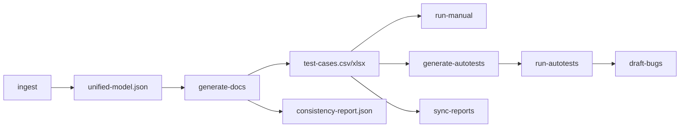

# ai_qahelper

Локальный CLI-агент для генерации тест-кейсов по шаблону (колонки: ID, Название тест-кейса, Предусловия, Описание шагов, Ожидаемый результат, Окружение, Статус, ID баг-репорта, Примечание). Источники данных: текстовые требования (файл `.md`/`.txt`, PDF, URL), опционально макеты Figma через [Figma REST API](https://www.figma.com/developers/api), генерация через [OpenAI API](https://platform.openai.com/).

Репозиторий: [https://github.com/q1nn2/ai_qahelper](https://github.com/q1nn2/ai_qahelper)

## Пайплайн



1. **ingest** — требования (файлы / URL), опционально Figma → единая модель и папка сессии под `tests/ai-sessions/`.
2. **generate-docs** — LLM: тест-анализ (опционально), тест-кейсы, опционально черновики багов → CSV/XLSX/JSON.
3. **run-manual** / **generate-autotests** + **run-autotests** — шаблоны ручного прогона или Playwright/pytest.
4. **draft-bugs** — черновики по падениям pytest (с учётом JUnit, эвристики severity/priority).
5. **sync-reports** — выгрузка в Google Sheets при настроенном сервисном аккаунте.

Имя папки сессии по умолчанию читаемое: `YYYY-MM-DD_HH-MM-SS_<slug>_<6hex>` (slug из первого файла требований или из host `--target-url`). Своя метка: **`--session-label` / `-L`**.

## Пример фрагмента требований (вход)

```markdown
## Маршрут
- Поля «Откуда» и «Куда» обязательны; при пустом значении показывается ошибка.
- Режим «Свой»: доступен выбор вида транспорта; маршрут пересчитывается.
```

## Пример выхода: test-cases.csv

Заголовки: `ID`, `Название тест-кейса`, `Предусловия`, `Описание шагов`, `Ожидаемый результат`, … В колонке шагов — нумерованный список в одной ячейке (`1. …`, `2. …`), файл в UTF-8 с BOM для Excel.

```csv
ID,Название тест-кейса,Предусловия,Описание шагов,Ожидаемый результат
TC-001,Проверка обязательности адреса,Открыт стенд,"1. Оставить «Откуда» пустым
2. Снять фокус","Отображается сообщение об ошибке"
```

## Пример bug-reports.csv (черновик)

Колонки: `bug_id`, `title`, `severity`, `priority`, `preconditions`, `steps`, `actual_result`, `expected_result`, …

```csv
bug_id,title,severity,priority,preconditions,steps,actual_result,expected_result
BUG-001,Некорректная валидация поля,major,high,Открыта форма,"Шаг 1 | Шаг 2",Поле не подсвечено,Подсветка ошибки
```

Скриншот UI сессии можно добавить в репозиторий (например `docs/session-screenshot.png`) и вставить в README; в публичных скринах не должно быть ключей и внутренних URL.

## Установка

```bash
cd ai_qahelper
python -m venv .venv
.venv\Scripts\activate
pip install -e .
```

Опционально (автотесты Playwright + pytest):

```bash
pip install -e ".[autotest]"
playwright install chromium
```

## Конфигурация

1. Скопируйте пример и отредактируйте:

   ```bash
   copy ai-tester.config.example.yaml ai-tester.config.yaml
   ```

2. В `ai-tester.config.yaml` задайте модель, при необходимости `llm.max_test_cases` (сколько тест-кейсов запрашивать у модели), и список разрешённых окружений (`envs`). Если `envs` пустой, проверка `target_url` отключена.

3. Ключ OpenAI: либо переменная окружения `OPENAI_API_KEY`, либо в **только локальном** `ai-tester.config.yaml` поле `llm.api_key: "sk-..."`. В `ai-tester.config.example.yaml` и в git секреты не кладутся. Поле `api_key_env` в YAML — это **имя** переменной окружения, а не сам ключ.

4. Переменные окружения:

   | Переменная | Назначение |
   |------------|------------|
   | `OPENAI_API_KEY` | Ключ OpenAI (если не задан `llm.api_key` в локальном yaml) |
   | `FIGMA_API_TOKEN` | Токен Figma (опционально, для `--figma-file-key`) |
   | `GOOGLE_SERVICE_ACCOUNT_JSON` | Путь к JSON сервисного аккаунта (опционально, для `sync-reports` в Google Sheets) |

Если ключ когда‑либо попал в отслеживаемый файл или в публичный репозиторий, [отзовите его](https://platform.openai.com/api-keys) и создайте новый.

## Команды

Из корня проекта, где лежит `ai-tester.config.yaml`:

```bash
ai-qahelper ingest --requirement tests/ai-docs/requirements.md --target-url https://example.com
ai-qahelper generate-docs <session_id>
```

Один шаг (ingest + generate-docs):

```bash
ai-qahelper agent-run --requirement tests/ai-docs/requirements.md --target-url https://example.com
# явно указать число кейсов (перекрывает llm.max_test_cases в конфиге):
ai-qahelper agent-run --requirement tests/ai-docs/requirements.md --target-url https://example.com --max-cases 5
# своя метка в имени папки сессии:
ai-qahelper agent-run -r tests/ai-docs/requirements.md --target-url https://example.com -L smoke-routes
```

С URL требований и Figma (ключ файла из URL макета `figma.com/file/<KEY>/...`):

```bash
ai-qahelper agent-run --requirement-url https://example.com/spec.html --figma-file-key AbCdEfGhIjKlMnOp --target-url https://example.com
```

Результаты сессии по умолчанию в `tests/ai-sessions/<session_id>/`:

- `test-cases.csv`, `test-cases.xlsx` — тест-кейсы
- `test-cases.json`, `unified-model.json`, `consistency-report.json`

## Работа в Cursor и Figma MCP

Вызвать MCP Figma из отдельного Python-процесса нельзя — MCP доступен в IDE. Рекомендуемый поток:

1. Подключите сервер Figma MCP в настройках Cursor.
2. В чате получите описание экранов, подписей, состояний и ограничений UI.
3. Сохраните это в файл, например `tests/ai-docs/figma-from-mcp.md`, и передайте в CLI:

   ```bash
   ai-qahelper agent-run --requirement tests/ai-docs/requirements.md --requirement tests/ai-docs/figma-from-mcp.md --target-url https://your-app.example
   ```

Так контекст макетов попадает в единую модель вместе с требованиями. При необходимости дополнительно укажите `--figma-file-key` и `FIGMA_API_TOKEN` для автоматической выгрузки дерева файла через API.

## Примечания

- Модель и endpoint задаются в `ai-tester.config.yaml` (`llm`). Клиент использует OpenAI SDK и метод `responses.create`. По умолчанию включается **structured output** (`llm.use_structured_json_output`: JSON Schema из Pydantic-модели); если API/модель не поддерживают — автоматический переход на обычный текст и разбор JSON.
- Ошибки конфига (нет файла, битый YAML, неверные поля) выводятся с указанием пути/поля; значения секретных полей в текст ошибки не попадают.
- `quality-gates.json` после `sync-reports`: покрытие требований — **эвристика** (`strict_source` по `source_refs` и `keyword_overlap` по текстам), не семантическая трассировка.
- Большие PDF и глубокое дерево Figma увеличивают размер промпта — при лимитах токенов укоротите входные документы или разбейте на части.

## Лицензия

MIT — см. [LICENSE](LICENSE).
