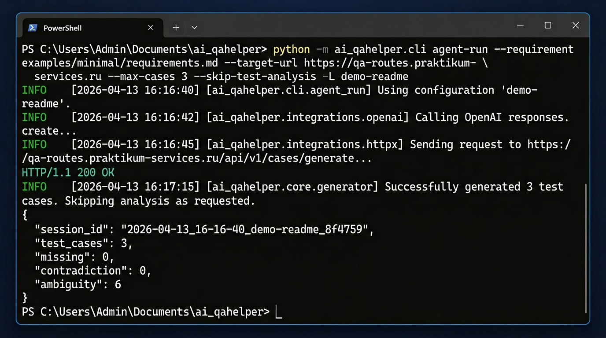

# ai_qahelper

Локальный **CLI-инструмент для QA**: принимает требования (Markdown, текст, PDF, Word, Excel, URL) и при необходимости макеты (Figma или описание в `.md`), затем генерирует **тестовую документацию** и базовые артефакты для дальнейшего **ручного** или **автоматизированного** прогона.

Это не «универсальный AI, который всё тестирует сам», а **помощник для подготовки качественной тест-документации и стартовых QA-артефактов** — ровно тот объём, который уже поддерживается кодом: ingest → unified model → отчёты и кейсы → опционально manual / Playwright-шаблоны.

**Подходит для:** manual QA, QA automation, AI-assisted test design, команд, которым нужно ускорить подготовку тестов перед спринтом или релизом.

## Демо

Реальный прогон `agent-run` по [`examples/minimal/requirements.md`](examples/minimal/requirements.md): в репозитории зафиксированы [вывод CLI, sample JSON и скрин](examples/demo-run/README.md).



*Визуализация терминала; session_id и сводка совпадают с записанным прогоном в [`examples/demo-run/`](examples/demo-run/). Записать свой GIF: [asciinema](https://asciinema.org/) или встроенная запись экрана Windows (Win+G).*

## Возможности

- Сбор требований из `.md`, `.txt`, `.pdf`, `.docx`, `.xlsx`, `.xls` best effort и URL
- Опционально: Figma (file key + `FIGMA_API_TOKEN`) или отдельный `.md` с описанием экранов (в т.ч. из Cursor / Figma MCP)
- Единая модель требований (`unified-model.json`)
- Эвристический **consistency**-отчёт и LLM **test analysis**
- Генерация **test cases** в CSV / XLSX / JSON
- По запросу: черновики bug reports, шаблоны ручного прогона, базовые **Playwright/pytest** тесты

## Быстрый старт

```bash
git clone https://github.com/q1nn2/ai_qahelper.git
cd ai_qahelper
python -m venv .venv
.venv\Scripts\activate   # Windows
# source .venv/bin/activate  # Linux / macOS
pip install -e .
copy ai-tester.config.example.yaml ai-tester.config.yaml   # Windows
# cp ai-tester.config.example.yaml ai-tester.config.yaml   # Unix
```

Скопируйте [`.env.example`](.env.example) в `.env` или задайте переменные окружения:

```bash
set OPENAI_API_KEY=your_key_here          # Windows cmd
# export OPENAI_API_KEY=your_key_here     # Unix
```

Минимальный запуск (готовый пример требований в репозитории):

```bash
python -m ai_qahelper.cli agent-run ^
  --requirement examples/minimal/requirements.md ^
  --target-url https://example.com ^
  --max-cases 5
```

В Unix замените `^` на `\` в конце строк или пишите в одну строку.

**Результаты** появляются в `runs/<session_id>/` (путь задаётся в `ai-tester.config.yaml`, ключ `sessions_dir`).

Свои требования можно класть в `examples/input/` или указывать любой путь в `--requirement`.

## Supported Requirement Inputs

Поддерживаются:

- `.md`
- `.txt`
- `.pdf`
- `.docx`
- `.xlsx`
- `.xls` best effort
- URL

Word `.docx`: извлекаются текст, заголовки, списки и таблицы. Встроенные изображения извлекаются и анализируются vision-моделью как визуальные требования: UI, поля, кнопки, состояния, ошибки, схемы и видимые бизнес-правила. Если изображение не удалось проанализировать или `llm.docx_vision` выключен, warning попадает в `RequirementItem.content` и `input-coverage-report.json`.

Excel `.xlsx`: читаются листы, строки и непустые ячейки, контент преобразуется в Markdown-like таблицы. Большие файлы могут быть урезаны по лимитам: первые 10 листов, 500 строк на лист и 50 колонок. Warnings сохраняются в `input-coverage-report.json` и добавляются в content требований.

PDF: текст читается напрямую, а картинки/сканы страниц анализируются через `pdf_vision`, если режим включён в конфиге.

## Natural Language AI Planner

В chat-режиме агент понимает сложные QA-задачи обычным языком, строит план действий и выполняет шаги по порядку. В одном сообщении можно смешивать несколько задач: анализ требований, поиск рисков, smoke / regression / negative проверки, чек-листы, автотесты, баг-репорты и выгрузку отчётов.

Запуск:

```bash
pip install -e .
ai-qahelper chat
```

Или отдельной командой:

```bash
ai-qahelper-chat
```

Примеры фраз:

- `Посмотри требования, найди риски, сначала сделай smoke, потом negative cases`
- `Сделай чек-лист, API проверки и негативные тесты`
- `Подготовь автотесты, но не запускай`
- `Запусти автотесты и потом создай баги по падениям`
- `Вот ссылка на сайт https://example.com, требований нет. Проанализируй сайт и напиши 15 тест-кейсов.`

Действия, которые запускают автотесты или меняют внешние Google Sheets, требуют подтверждения в UI. Если LLM-планировщик недоступен или вернул некорректный JSON, chat-agent автоматически переключается на базовое распознавание команд по ключевым словам и показывает предупреждение.

## Site Discovery Mode

В chat-режиме можно генерировать exploratory test cases по сайту без требований. Это не заменяет тестирование по требованиям: агент анализирует только фактически видимые элементы сайта и не должен придумывать бизнес-требования.

Пример:

```text
Вот ссылка на сайт https://example.com, требований нет. Проанализируй сайт и напиши 15 тест-кейсов.
```

Расширенный пример:

```text
Требований нет. Пройди по сайту https://example.com, исследуй до 5 страниц и сделай smoke + negative тест-кейсы.
```

В этом режиме агент безопасно обходит внутренние ссылки same-domain с лимитами `max_pages` и `max_depth`, не ходит по внешним доменам, `mailto:`, `tel:`, `javascript:` и файлам вроде PDF/ZIP/картинок. В Streamlit chat sidebar можно задать `max_pages`, `max_depth`, `same_domain_only`, `use_playwright`, `timeout_seconds` и создание screenshots.

Discovery работает в safe/read-only mode: не отправляет формы, не нажимает submit, не меняет данные, не оформляет заказы и не выполняет destructive actions. Если найден `robots.txt`, crawler учитывает базовые `Disallow` для `User-agent: *`; если найден `sitemap.xml` или sitemap указан в `robots.txt`, URL из sitemap используются как кандидаты, но всё равно ограничиваются `max_pages` и same-domain правилами.

Если страниц больше, чем `max_pages`, crawler сначала выбирает QA-важные ссылки: login / вход, register / регистрация, catalog / каталог, cart / корзина, checkout / оформление, order / заказ, payment / оплата, profile / профиль, search / поиск, contacts / контакты, feedback, support.

В результате создаются:

- `site-model.json` — страницы, заголовки, ссылки, формы, поля, кнопки, alt-тексты изображений, видимый текст, HTTP status, console errors, network failures и summary.
- `exploratory-report.json` — inventory навигации и форм, accessibility basics, риски/пробелы, suggested test areas и limitations.
- `exploratory-report.md` — читаемый QA-отчёт: цель анализа, страницы, формы, поля, кнопки, console/network ошибки, accessibility risks, suggested areas, limitations и предупреждение, что это фактический UI, а не требования продукта.
- `unified-model.json` — synthetic model для обычной генерации документов.

Если доступен Playwright, discovery использует один browser/context на весь crawl и дополнительно собирает screenshots, console errors и network failures. Если Playwright недоступен, используется fallback на `httpx` + HTML parsing.

Ограничения режима: нет проверки бизнес-правил, нет авторизации, нет изменения данных на сайте, анализируется только видимый UI в пределах заданных лимитов. В ответе агент явно предупреждает: тест-кейсы созданы по фактическому поведению сайта, а не по требованиям.

## Минимальный пример требований

Файл [`examples/minimal/requirements.md`](examples/minimal/requirements.md) уже лежит в репозитории — его можно не менять для первого прогона.

## Что будет на выходе

В папке сессии (`runs/<session_id>/`), среди прочего:

| Файл | Назначение |
|------|------------|
| `unified-model.json` | Сводная модель требований и целевого URL |
| `input-coverage-report.json` | Что было найдено во входных требованиях: текст, таблицы, изображения, Excel-листы и warnings |
| `test-analysis.json` | Тест-анализ и условия (если шаг не отключён) |
| `consistency-report.json` | Эвристика: пропуски, противоречия, неоднозначности |
| `test-cases.csv` / `.xlsx` / `.json` | Тест-кейсы под шаблон исполнителя |
| `dedup-report.json` | Локальный отчёт по удалённым дублям тест-кейсов |

Иллюстративные копии (без вызова LLM) лежат в [`examples/sample-output/`](examples/sample-output/).

## Deduplication Of Test Cases

Перед сохранением и экспортом тест-кейсы проходят локальное удаление дублей без LLM и внешних API. Проверяются нормализованные `title`, связка `title + expected_result`, а также похожесть `steps + expected_result` через стандартную библиотеку.

После dedup `case_id` перенумеровываются последовательно (`TC-001`, `TC-002`, ...), уникальные `source_refs` удалённых дублей объединяются в оставшемся кейсе, а в `note` добавляется отметка `Merged duplicate: <old_case_id>`.

В папке сессии создаётся `dedup-report.json` (или `dedup-report-smoke.json`, `dedup-report-negative.json`, `dedup-report-regression.json` для focused generation). Это снижает мусор в `test-cases.xlsx` и помогает тестировщику работать с более чистым набором проверок.

## Figma

С ключом файла из URL макета (`figma.com/design/<KEY>/...`):

```bash
python -m ai_qahelper.cli agent-run ^
  --requirement examples/minimal/requirements.md ^
  --figma-file-key YOUR_FILE_KEY ^
  --target-url https://example.com
```

Нужен **`FIGMA_API_TOKEN`** (см. `.env.example`).

Без API: опишите экраны в Markdown (например, [`examples/minimal/figma-notes.md`](examples/minimal/figma-notes.md)) и передайте вторым `--requirement`.

## Основные команды

| Команда | Назначение |
|---------|------------|
| `ingest` | Собирает unified model из файлов / URL и опционально Figma |
| `generate-docs` | LLM: test analysis, test cases, опционально bug drafts |
| `agent-run` | **ingest + generate-docs** одной командой |
| `run-manual` | Шаблоны для ручного прогона |
| `generate-autotests` | Базовые Playwright/pytest файлы |
| `run-autotests` | Запуск сгенерированных тестов |
| `draft-bugs` | Черновики багов по падениям pytest |
| `sync-reports` | Выгрузка в Google Sheets (при настроенном сервисном аккаунте) |

Запуск: `python -m ai_qahelper.cli <команда> ...` (или `ai-qahelper`, если скрипт в PATH).

## Структура репозитория

- `src/ai_qahelper/` — код CLI и пайплайна  
- `tests/unit`, `tests/integration` — тесты **инструмента** (pytest)  
- `examples/minimal` — демо-входы  
- `examples/sample-output` — пример артефактов  
- `examples/input` — удобное место для ваших требований (по желанию)  
- `runs/` — **реальные** результаты ваших запусков (в git не коммитятся, кроме `.gitkeep`)

## Ограничения

- Качество тест-кейсов зависит от полноты и ясности входных требований.
- Проверки consistency / coverage — **эвристические**, не семантическая трассировка требований.
- Сгенерированные Playwright/pytest тесты — **стартовые шаблоны**, а не готовый regression suite.
- Для LLM нужен **OpenAI API key** (или совместимый endpoint в конфиге).
- Для дерева Figma через API — **Figma token**.

## Roadmap

- [ ] Улучшить генерацию локаторов и assertions в Playwright  
- [ ] Расширить unit / integration tests  
- [ ] GitHub Actions CI (уже есть базовый workflow)  
- [ ] Docker / devcontainer  
- [ ] Экспорт под TestRail / Zephyr  
- [ ] Усилить traceability requirements → test cases  
- [ ] Интерактивный режим запуска (wizard)

## Разработка

```bash
pip install -e ".[dev]"
python -m ruff check src tests
python -m pytest tests -v
```

Интеграционный smoke с реальным LLM выполняется только при наличии `OPENAI_API_KEY` и `ai-tester.config.yaml` в корне.

## Лицензия

MIT — см. [LICENSE](LICENSE).
